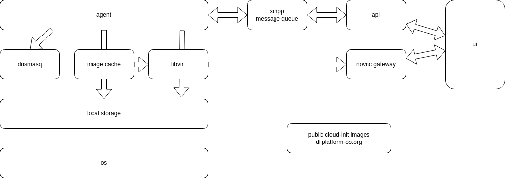

## VM Builder Project

The VMBuilder is a collection of repositories for making the easiest way
to deploy and manipulate KVM/QEMU virtual machines in small infrastructures.

## Key components

- DNS and DHCP control
- Cloud-init images storage
- Deploy Virtual machines using Cloud-init
- NoVNC access management

## Scheme

## Environment

- OS Debian 12
- Three Intel NUC for QEMU/KVM (8Gb RAM, 256 NVMe)
- One NFS Server (2Tb SSD)
- 1Gbit Ethernet Switch

